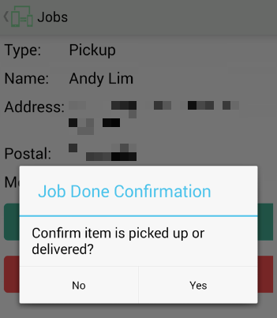

# Courier Service Management Android App

#### Contents
- [Abstract](https://github.com/thisisclement/Courier-Service-Management-CMS#abstract)
- [Technical details](https://github.com/thisisclement/Courier-Service-Management-CMS#problem-statement)
- [Features](https://github.com/thisisclement/Courier-Service-Management-CMS#features)

## Abstract

This is an extended project to the Courier Service Management System on my [GitHub](https://github.com/thisisclement/Courier-Service-Management-CMS).

The Courier Service Management Android App aims to streamline the delivery process and notify users on the delivery or pickup of their parcel.

_Disclaimer: All personal information like addresses and mobile numbers are pixelised for privacy reasons. Names are fictitious and any reference to a real-life person is purely coincidental._

## Technical details

OS: Android KitKat v4.4
IDE used: Eclipse

## Features

  1. List of jobs and job details display
  

  
  
  
  

  
  2. Jobs list refresh
  3. One-touch call
  4. One-touch navigation to pickup/delivery destination
  5. Job done notification to users
  

  
  

  6. Report sick for delivery personnel
  

  
  

